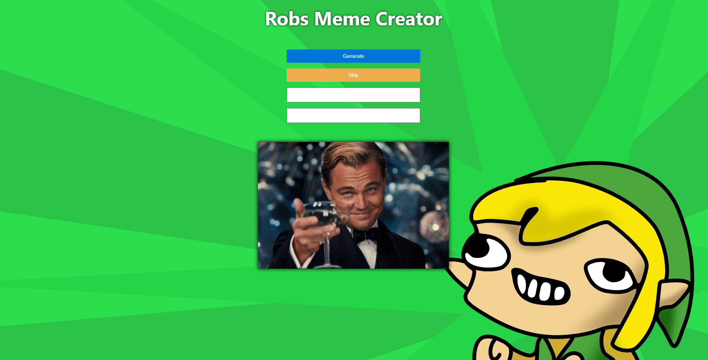
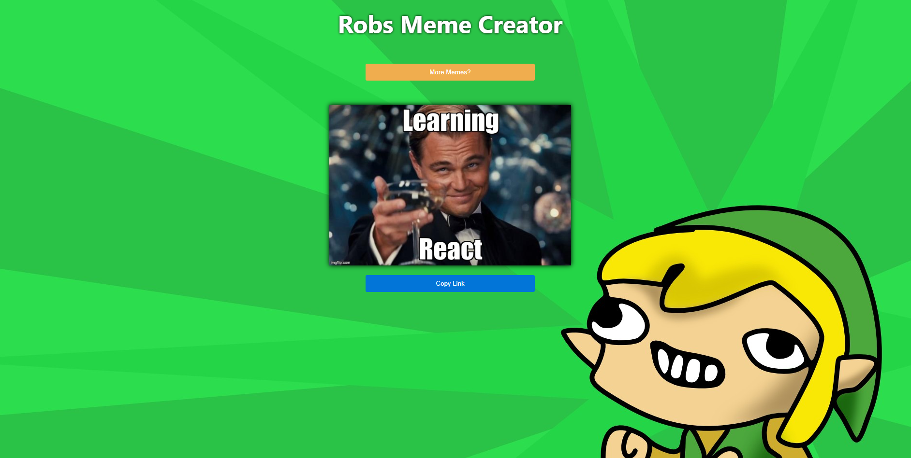

# Meme-Generator
A react project that uses routing, hooks and json responses to create a web app that sources and edits memes from [Imgflip](https://api.imgflip.com) 

## Installation

This project runs on Node.js, so first if you havent already, install node globally on your device.
This project also requires react, installation details can be found here, aswell as starting your react space... [getting started with react](https://reactjs.org/docs/getting-started.html)

There are also a number of playgrounds for react if you wish to not work with the project locally...
Here is a good place to install this [Node Index Page](https://nodejs.org/download/), and here is a useful [gist](https://gist.github.com/isaacs/579814)

Once installed, clone the repository and install its dependencies running:

`$ npm install`

### Credentials

In order to gain access to image data from Imgflip you will first need to create an account.
Create an account for yourself here [Imgflip](https://api.imgflip.com) 

Next navigate to line 39 and 40 in Meme.js of the cloned project.

`formData.append('username', '********');`

`formData.append('password', '********');`

Replace the stars in this lines of code with your username and password.

### Walkthrough

The initial page is where you are able to skip though different images, and add labels.

When an image is generated, you are able to share the url of the image by clicking *Copy Link* otherwise you can create other images by clicking *More Memes?*.

